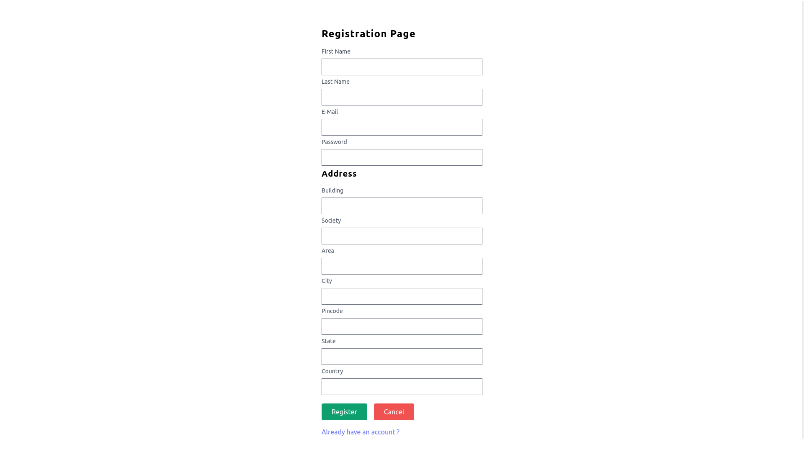
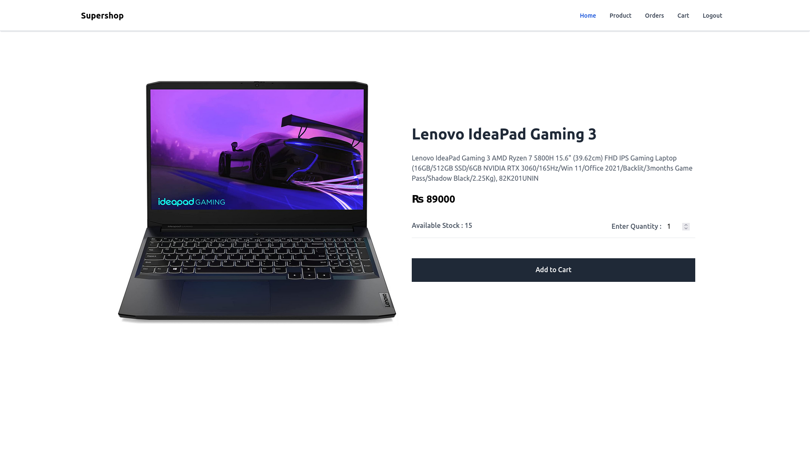

<!--
-->

# SuperShop E-commerce

SuperShop Online Store is an Online E-commerce application. SuperShop is a modern e-commerce application with all needs to run an E-commerce business.


Note : UI is under progress for some of the functionality of this application
## Features

### Customer

- Register, Login and Logout
- Updating Profile
- Check all the available Products
- Add, update and remove products to/from cart
- Placing Order and Payment
- Tracking Order


### Admin 


- All customer operations
- Create customer, update and remove customer
- Managing categories
- Managing products 
- Managing orders
- Check all the orders


## Run Locally

Clone the project

```bash
 git clone https://github.com/dipeshsingh253/SuperShop-Online-Store
```

Go to the project directory

```bash

//Backend
   cd SuperShop

//Frontend
   //in another terminal window
   cd super-shop-ui

```

Install maven

```bash

//Backend
   // if maven is not installed then instll maven wrapper

  ./mvnw install 

//Frontend

  //install dependencies

  npm install

  //
```

Start the server

```bash
 // before starting the server 'spring.sql.init.mode=always' this line in application.properties file
 // once server started successfuly then uncomment above commented line from application.properties and re run the server
 // this way data.sql will be executed successfuly 
//Backend
  ./mvnw spring-boot:run


//Frontend
  
  npm start
```


## Tech Stack

**Backend:** SpringBoot, Maven, Hibernate, MySql, MVC

**Frontend:** React, HTML, JavaScript, Tailwind CSS

## ER Diagram


<hr/>


## Screenshots







